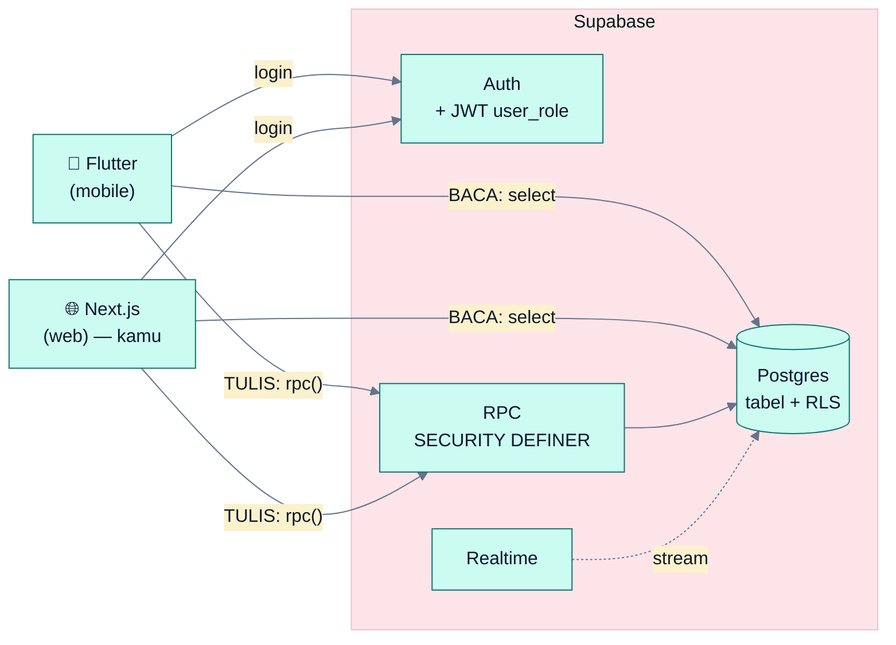
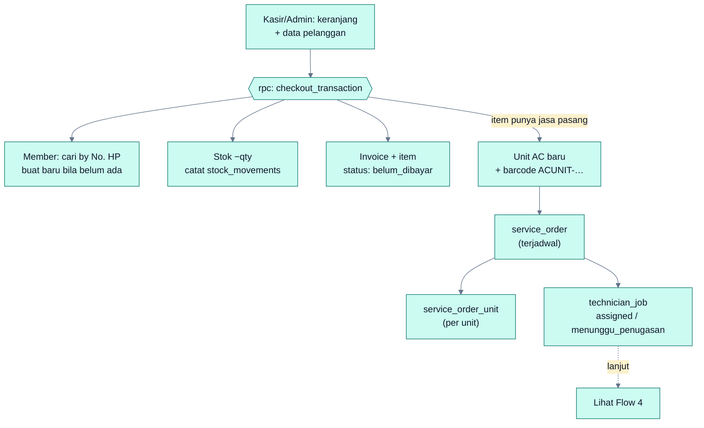
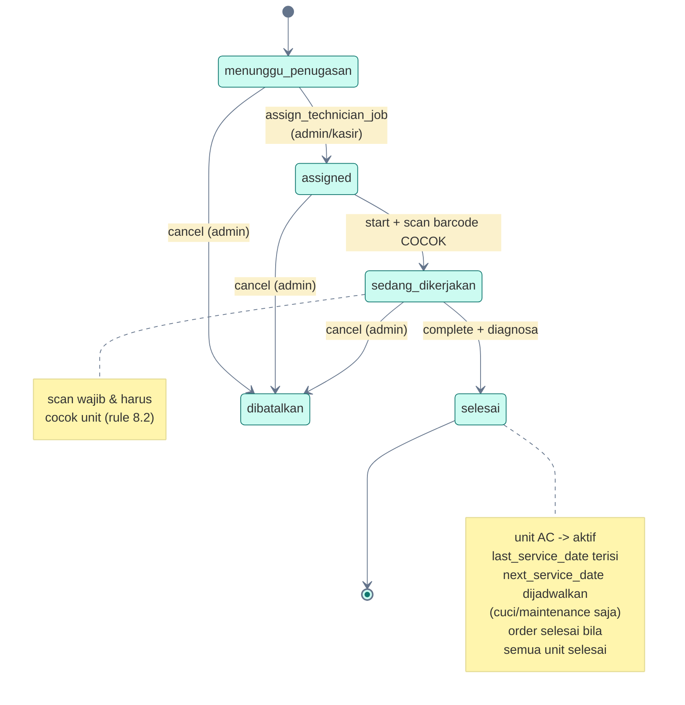
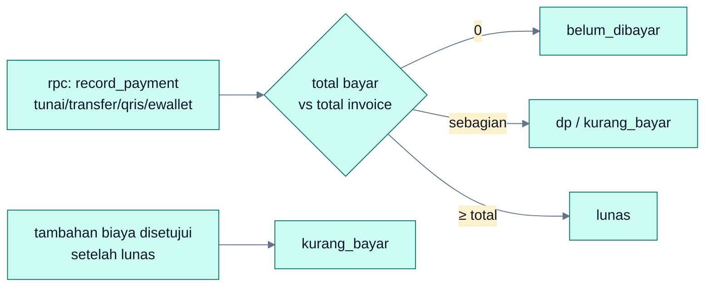
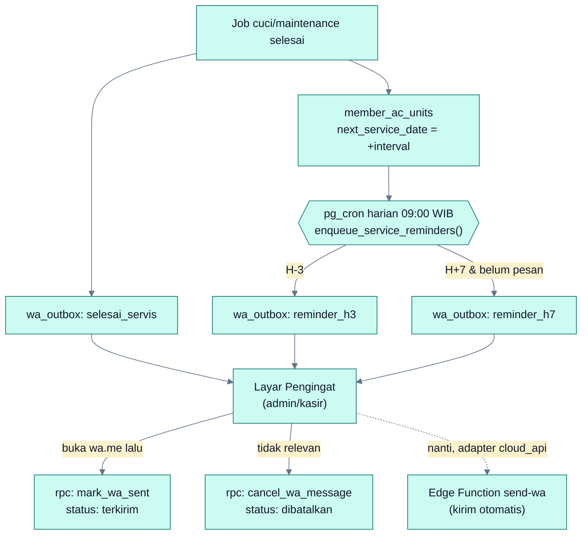

# Flow Sistem E-POS AC

Alur inti sistem — dipakai bersama oleh **Flutter (mobile)** dan **Next.js (web)** di atas backend Supabase yang sama. Semua penulisan data lewat **RPC**; pembacaan lewat `select` (dibatasi RLS); peran dibaca dari **klaim JWT `user_role`**.

---

## 1. Arsitektur — satu backend, dua frontend



> Web tidak membuat backend baru — hanya memanggil auth, RPC, dan tabel yang sama. RLS menjaga data di sisi server apa pun frontend-nya.

---

## 2. Login & Peran (dari mana `user_role` datang)

```mermaid
%%{init: {'theme':'base','themeVariables':{'primaryColor':'#CCFBF1','primaryBorderColor':'#0F766E','lineColor':'#64748B','fontFamily':'system-ui'}}}%%
sequenceDiagram
  autonumber
  participant C as Client (web/mobile)
  participant Auth as Supabase Auth
  participant Hook as custom_access_token_hook
  participant U as tabel users
  C->>Auth: signInWithPassword(email, password)
  Auth->>Hook: terbitkan access token
  Hook->>U: baca role (hanya jika active)
  U-->>Hook: admin | kasir | teknisi
  Hook-->>Auth: sisipkan klaim user_role
  Auth-->>C: JWT berisi user_role
  Note over C: gate menu berdasar role;<br/>server tetap dijaga RLS
```

> Baca role di client: decode `session.access_token` → `user_role`. Jangan query tabel `users` untuk otorisasi menu — pakai klaim JWT.

---

## 3. Checkout POS → member, unit, order, job

Satu panggilan `checkout_transaction` mengurus semuanya secara atomik.



> Beli AC + jasa pasang otomatis melahirkan member, unit, barcode, order, dan job teknisi — tanpa input ganda.

---

## 4. Siklus status Job Teknisi



> Transisi dilakukan lewat `update_technician_job_status` (`start` / `complete` / `cancel`). Teknisi hanya boleh mengubah job miliknya; `cancel` hanya admin.

---

## 5. Pembayaran manual & status invoice



> Satu invoice bisa punya banyak pembayaran. Status dihitung otomatis oleh RPC (total invoice − total bayar). Kalau sudah lunas lalu ada biaya tambahan → kembali `kurang_bayar`.

---

## 6. Pengingat servis via WhatsApp

Pesan tidak pernah dikirim langsung dari trigger — semuanya masuk antrean
`wa_outbox` dulu, supaya cara kirimnya bisa diganti tanpa menyentuh skema.



> Interval diambil dari override per unit (`service_interval_days`), lalu default
> per jenis job (`reminder_settings`). Job berjalan pada unit yang sama otomatis
> menghentikan pengingatnya. `dedupe_key` menjamin scheduler yang jalan berkali-kali
> tidak pernah membuat pesan kembar.

---

### Ringkas untuk web (Next.js)

| Butuh | Caranya |
|-------|---------|
| Login | `supabase.auth.signInWithPassword(...)` |
| Tahu peran | decode JWT → klaim `user_role` |
| Buat transaksi | `supabase.rpc('checkout_transaction', { payload })` |
| Catat bayar | `supabase.rpc('record_payment', { payload })` |
| Tugaskan/kerjakan job | `assign_technician_job` / `update_technician_job_status` |
| Kirim pengingat servis | buka `https://wa.me/<phone>?text=…` lalu `mark_wa_sent` |
| Tampilkan data | `supabase.from('...').select()` (RLS otomatis) |

Semua RPC & kontrak lengkapnya ada di halaman **Panduan Backend**.
