# Flowchart Sistem EPOS AC (Mermaid)

Dibaca dari kode backend NestJS dan skema database. Satu bagian = satu alur. Versi draw.io: `Flowchart-Sistem-EPOS-AC.drawio`.

Legenda: kotak **merah** = ditolak / error, belah ketupat = keputusan.

---

## 01. Arsitektur

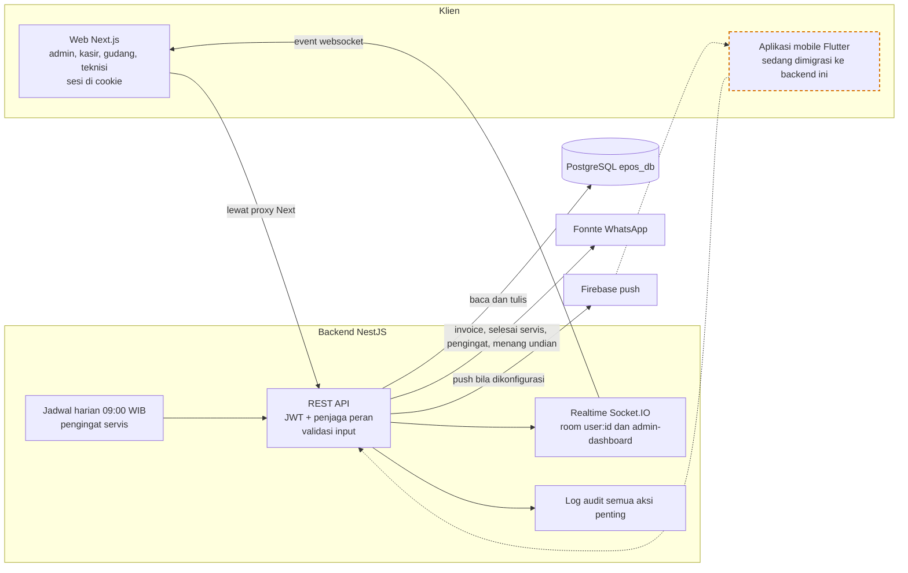

---

## 02. Login dan keamanan

Role dibaca ulang dari database di setiap request, bukan dipercaya dari isi token.

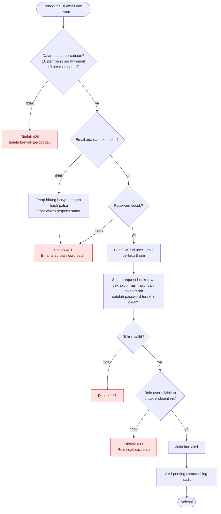

---

## 03. Barang masuk (stock-in)

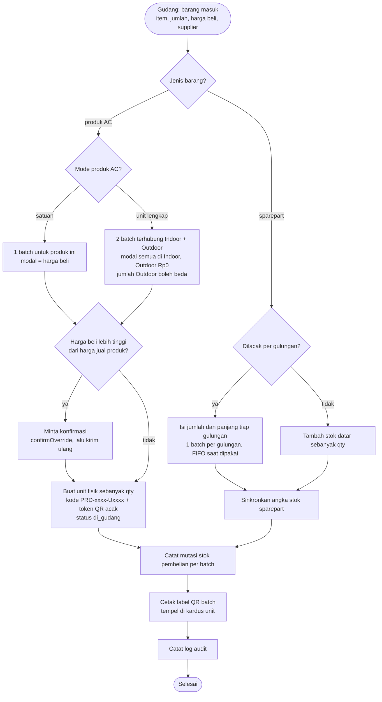

---

## 04. Checkout POS

Semua langkah berjalan dalam satu transaksi database. Gagal di tengah berarti tidak ada yang tersimpan.

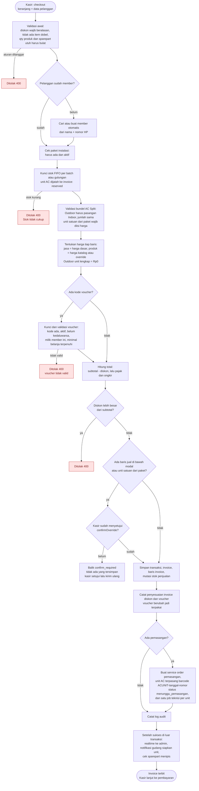

---

## 05. Pembayaran, kirim WhatsApp, dan shift kasir

Tidak ada verifikasi pembayaran terpisah: pembayaran yang dicatat kasir langsung berlaku. Shift hanya pencatatan kas, bukan syarat checkout.

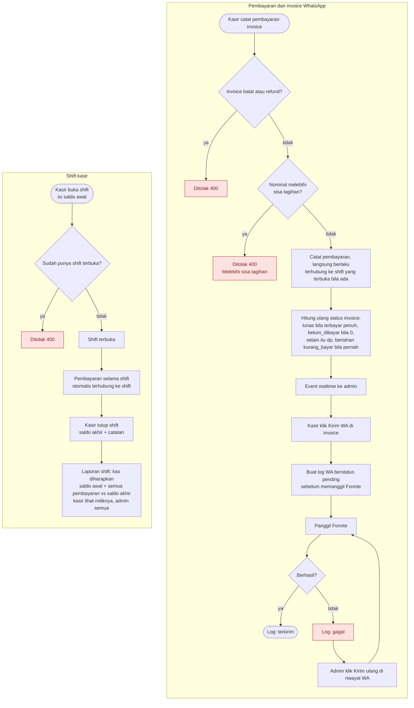

---

## 06. Keluar gudang (scan QR atau ceklist manual)

Checkout hanya menjatah unit (reserved). Unit baru resmi keluar setelah discan. Dikerjakan **gudang** (atau admin) di halaman Keluar Gudang; kasir cukup checkout. Scan menerima token QR atau kode label (PRD-0001-U0007).

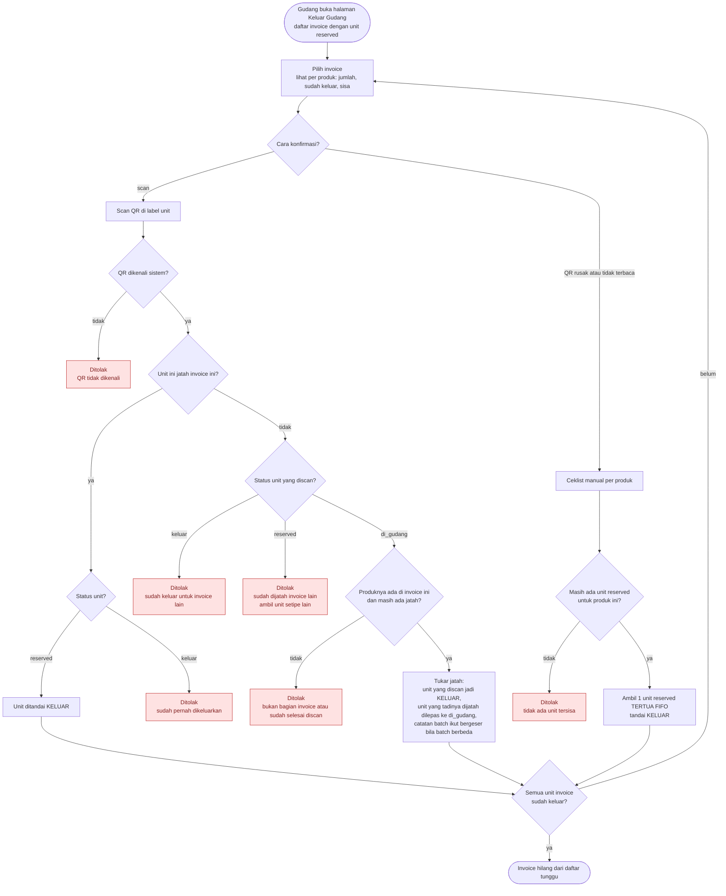

---

## 07. Servis masuk (servis mandiri)

Jalur selain checkout: pelanggan membawa AC lama. Memakai mesin job teknisi yang sama dengan pemasangan.

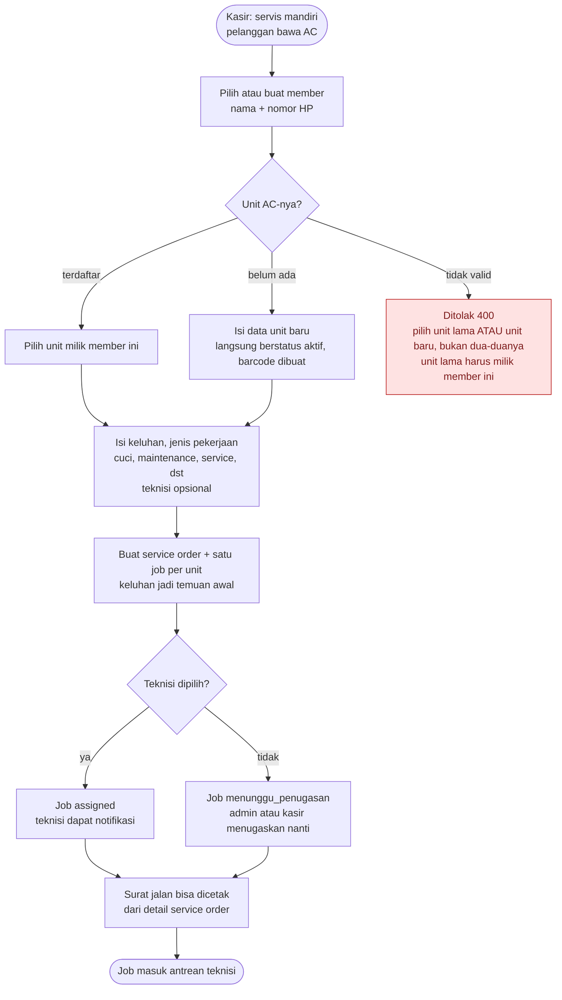

Mobile memakai endpoint lain (service order manual): unit harus sudah terdaftar dan milik member yang sama, teknisi harus aktif.

---

## 08. Siklus job teknisi

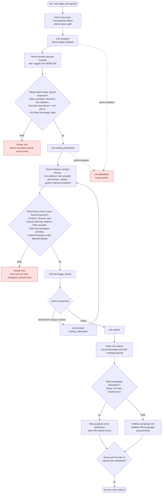

Mode offline teknisi (mobile): aksi disimpan di HP lalu dikirim batch ke `sync-batch`. Tiap aksi punya id unik (idempoten), konflik bila job berubah di server, satu aksi gagal tidak membatalkan aksi lain.

---

## 09. Pengajuan material oleh teknisi

Stok baru dipotong saat teknisi menandai material dipakai, bukan saat diajukan atau disetujui.

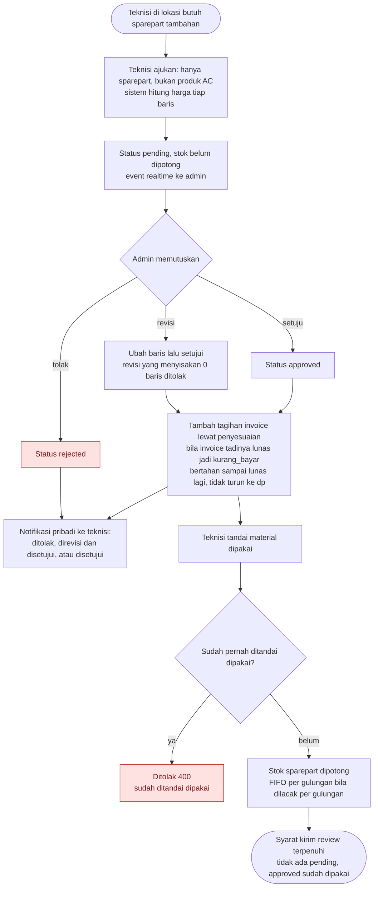

---

## 10. Unit AC terpasang: data, scan, koreksi, label

Satu unit terpasang = satu barcode, walau terdiri dari dua produk (Indoor dan Outdoor). Teknisi tidak boleh mengubah data unit aktif langsung.

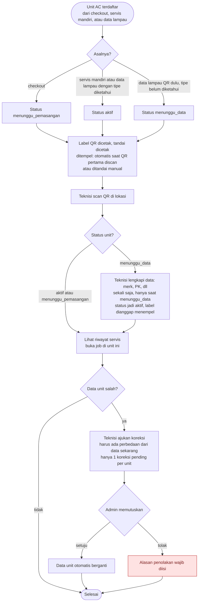

---

## 11. Pengingat servis otomatis lewat WhatsApp

Berjalan tiap hari 09:00 WIB, bisa dipicu manual admin. Aman dijalankan berulang karena kunci unik mencegah pesan dobel.

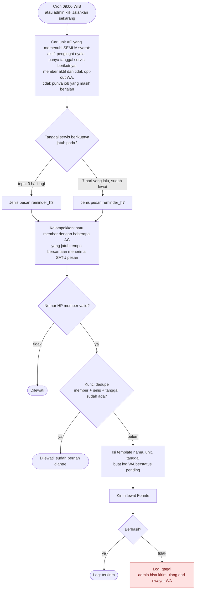

Catatan: member opt-out WA membatalkan pesan yang masih pending (log: dibatalkan). Admin mengatur siklus servis per jenis job (hanya cuci atau maintenance), interval per unit, dan redaksi template (invoice, selesai servis, reminder_h3, reminder_h7).

---

## 12. Member, voucher, dan undian

Voucher itu satu kode untuk satu member, dibuat admin, dipakai kasir dengan mengetik kode saat checkout. Tidak ada langkah klaim.

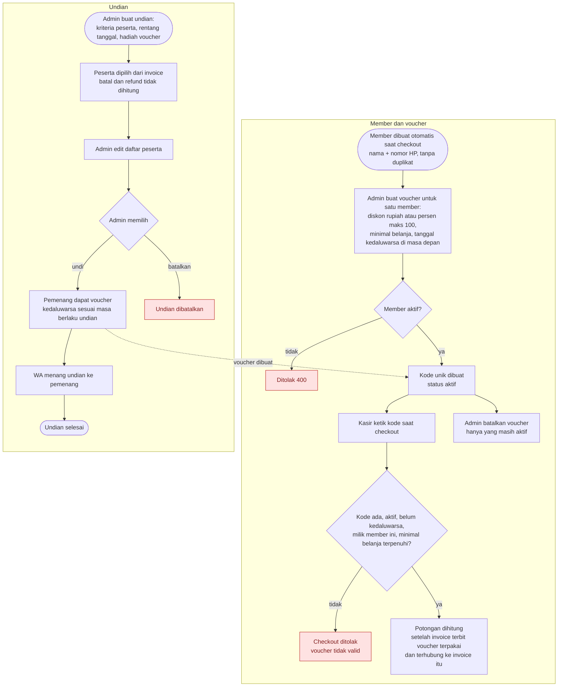

Undian yang sudah selesai atau dibatalkan tidak bisa diubah, diundi, atau dibatalkan lagi.

---

## 13. Opname, koreksi stok, dan laporan stok

Opname produk AC per unit belum didukung, karena stok AC dihitung dari unit QR. Koreksi manual produk juga ditolak.

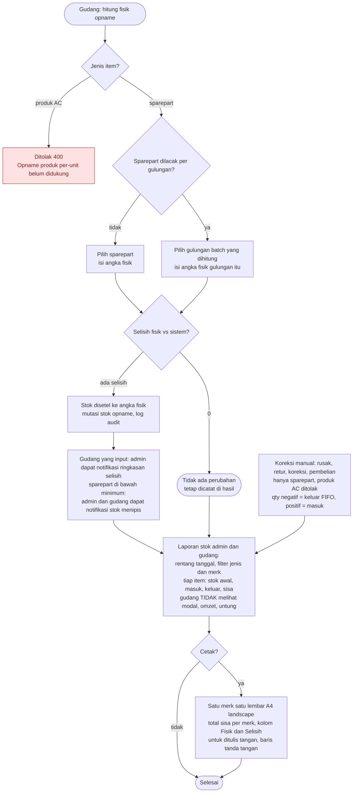

---

## 14. Administrasi: data lampau, pengguna, reset sistem

Hanya admin. Fitur yang mengubah banyak data sekaligus berjalan dalam satu transaksi dan tercatat di log audit.

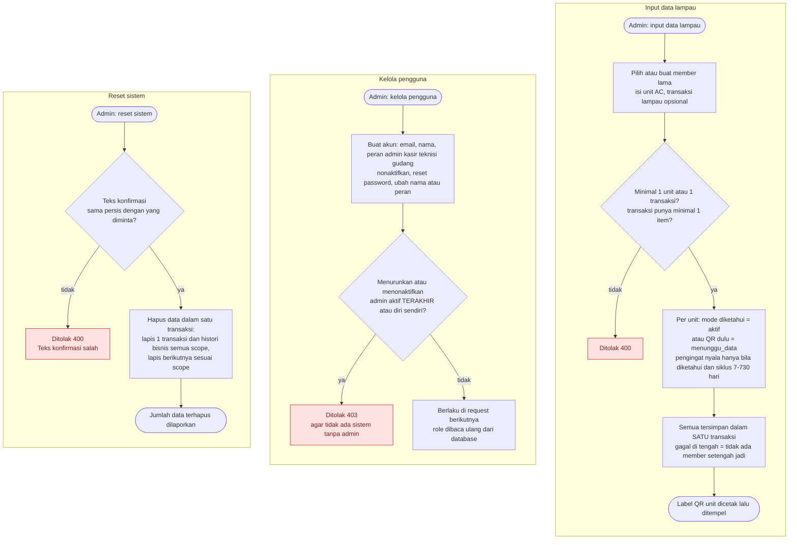

---

## 15. Status dokumen

Setiap dokumen hanya bisa berpindah mengikuti panah ini.

### Job teknisi

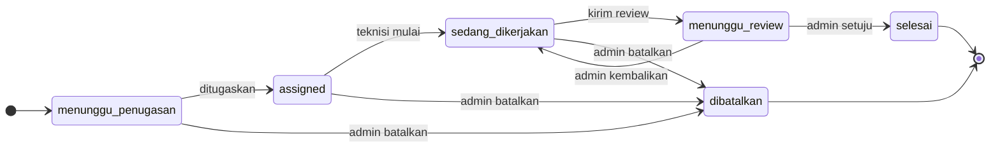

### Invoice

Status dihitung otomatis dari jumlah yang dibayar. Setelah pernah `kurang_bayar`, statusnya bertahan sampai lunas lagi. Status `batal` dan `refund` ada di database dan pembayaran untuk invoice itu ditolak, tapi belum ada alur di kode yang menyetelnya.

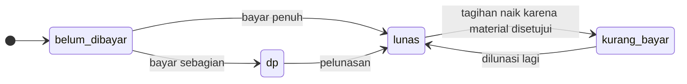

### Unit AC di gudang

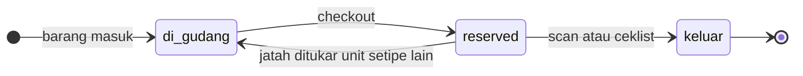

### Pengajuan material teknisi

Setelah `approved`, teknisi menandai material dipakai (penanda terpisah, saat itu stok dipotong).

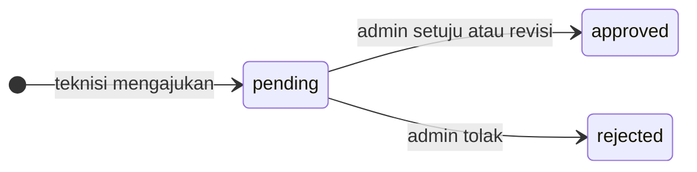

### Unit AC terpasang

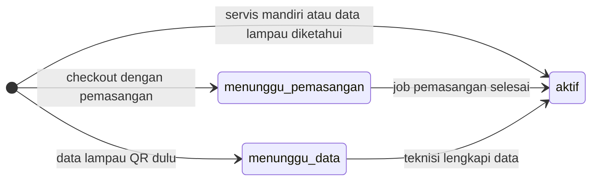

### Voucher

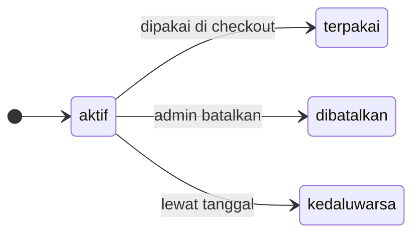

### Log WhatsApp

```mermaid
stateDiagram-v2
  direction LR
  [*] --> pending
  pending --> terkirim: Fonnte sukses
  pending --> gagal: Fonnte gagal
  gagal --> terkirim: kirim ulang
  pending --> dibatalkan: member opt-out
```

### Undian

```mermaid
stateDiagram-v2
  direction LR
  [*] --> berjalan
  berjalan --> selesai: diundi
  berjalan --> dibatalkan: admin batalkan
```

---

## 16. Notifikasi: siapa diberi tahu apa

Notifikasi pribadi tersimpan di database, tampil di lonceng web, dan dikirim sebagai push bila Firebase dikonfigurasi. Event admin hanya sampai ke admin yang sedang membuka dashboard.

```mermaid
flowchart LR
  T1["Checkout selesai"] --> D1["Event realtime ke admin<br/>transaksi baru"]
  T2["Checkout berisi produk AC"] --> D2["Notifikasi ke gudang<br/>siapkan N unit"]
  T3["Stok sparepart turun<br/>sampai batas minimum"] --> D3["Notifikasi ke admin + gudang<br/>tidak dikirim ulang selama belum dibaca"]
  T4["Opname dengan selisih<br/>oleh gudang"] --> D4["Notifikasi ringkasan selisih ke admin"]
  T5["Admin menugaskan job"] --> D5["Notifikasi pribadi ke teknisi terkait"]
  T6["Status job berubah"] --> D6["Event realtime ke admin"]
  T7["Teknisi mengajukan material"] --> D7["Event realtime ke admin"]
  T8["Admin memutuskan pengajuan"] --> D8["Notifikasi pribadi ke teknisi terkait"]
  T9["Pembayaran dicatat atau<br/>service order dibuat"] --> D9["Event realtime ke admin"]
  T10["Invoice, selesai servis,<br/>pengingat, menang undian"] --> D10["WhatsApp ke pelanggan<br/>Fonnte, tercatat di riwayat WA"]
```

---

## 17. Akses per peran

Dibaca dari penjaga peran di tiap endpoint.

| Bidang | Admin | Kasir | Teknisi | Gudang |
|---|:-:|:-:|:-:|:-:|
| POS dan checkout | ✓ | ✓ | – | – |
| Pembayaran dan riwayat transaksi | ✓ | ✓ | – | – |
| Shift kasir | – | ✓ buka dan tutup | – | – |
| Member | ✓ | ✓ | – | – |
| Voucher dan undian | ✓ kelola | ✓ lihat voucher | – | – |
| Service order dan penugasan | ✓ | ✓ intake, lihat, tugaskan | ✓ job miliknya | – |
| Kerja teknisi (temuan, foto, review) | ✓ | – | ✓ | – |
| Pengajuan material | ✓ putuskan | – | ✓ ajukan dan tandai dipakai | – |
| Stok: masuk, opname, adjust, mutasi | ✓ | – | – | ✓ |
| Label QR unit | ✓ | ✓ | – | ✓ |
| Scan unit keluar gudang (Keluar Gudang) | ✓ | – | – | ✓ |
| Lihat produk dan sparepart | ✓ | ✓ | ✓ | ✓ |
| Ubah produk, sparepart, harga jual | ✓ | – | – | – |
| Laporan stok tanpa modal, omzet, untung | ✓ | – | – | ✓ |
| Laporan penjualan, servis, laba-rugi | ✓ | – | – | – |
| Pengingat dan template WA | ✓ kelola | ✓ lihat | – | – |
| Pengguna, pengaturan, audit, data lampau, reset | ✓ | – | – | – |

---

## 18. Alur QR unit AC

Dua QR berbeda: QR unit gudang (kardus di rak, kode `PRD-0001-U0007`) dan QR unit terpasang (di AC rumah pelanggan, dipindai teknisi).

```mermaid
flowchart TB
  subgraph GUDANG["GUDANG"]
    direction TB
    G1["Barang masuk stock-in<br/>tiap unit dapat kode + QR"]
    G2["Cetak label QR<br/>tempel di kardus unit"]
    G5["Ambil unit dari rak"]
    G6["Scan QR di label unit"]
    G7{"QR terbaca?"}
    G8["Ceklist manual tanpa scan"]
  end
  subgraph KASIR["KASIR"]
    direction TB
    K1["Checkout di POS<br/>pilih produk, bayar"]
  end
  subgraph SISTEM["SISTEM"]
    direction TB
    S1["Unit dijatah ke invoice<br/>status reserved"]
    S2["Notifikasi ke gudang<br/>siapkan N unit"]
    S3["Unit ditandai KELUAR<br/>stok resmi berkurang"]
  end
  subgraph TEKNISI["TEKNISI"]
    direction TB
    T1["Pasang AC di rumah pelanggan<br/>unit terpasang dapat barcode sendiri"]
    T2["Scan QR unit terpasang<br/>lihat riwayat, lengkapi data"]
  end

  G1 --> G2
  G2 -- "unit siap dijual" --> K1
  K1 --> S1
  S1 --> S2
  S2 --> G5
  G5 --> G6
  G6 --> G7
  G7 -- "ya" --> S3
  G7 -- "tidak" --> G8
  G8 --> S3
  S3 --> T1
  T1 --> T2

```
